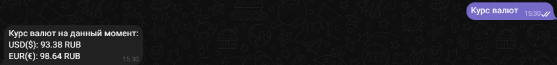
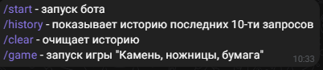

# Новостной телеграмм бот (BBC)

## Содержание:
1. [Описание команд](#command)
    - [/start](#command)
    - [/help](#help)
    - [/history](#history)
    - [/clear](#clear)
    - [/game](#game)

2. [API](#api)

3. [Sqlite](#sqlite)
---

### Описание команд

#### -Комнада /start

Для начала работы бота необходимо ввести команду __/start__. После чего бот вам ответит, что можно выбрать любое кол-во новостей, либо же показать курс валют доллара и евро.

За команду __/start__ в телеграмм боте отвечает данный код:

    @bot.message_handler(commands=['start'], func=lambda message: True)
    def welcome(message):
        """Функция приветствия"""
        bot.send_message(message.chat.id,
                        'Привет. Я новостной бот BBC. Я могу отправлять вам самые последние новости мира.')
        markup = types.ReplyKeyboardMarkup(resize_keyboard=True)
        three_news = types.KeyboardButton('3 новости')
        five_news = types.KeyboardButton('5 новостей')
        custom = types.KeyboardButton('Введите кол-во новостей')
        currency = types.KeyboardButton('Курс валют')
        markup.add(three_news, five_news, custom, currency)

        bot.send_message(message.chat.id, 'Выберите количество новостей, которые вы хотели бы увидеть.', reply_markup=markup)

 
Далее мы выбираем, либо кол-во новостей, либо курс валют. В зависимости от выбора бот отправляется нам сообщение. Если это новость, то бот отправит тайтл новости и ссылку на источник:
  

А если это курс валют:

  

#### -Команда /help

Данная команда исполняет роль навигатора по боту. Она выводит все команды, которые есть в боте (сделано по аналогии [/start](#start)):

  

#### -Команда /history

Команда реализована при помощи __sqlite__, которая служит базой данных (о ней подробнее [тут](#sqlite)).
Бот подключается к БД, выбирает оттуда перввый элемент и выводит в кастомном формате.

    @bot.message_handler(commands=['history'], func=lambda message: True)
    def check_history(message):
        conn = sqlite3.connect('database.db')
        cursor = conn.cursor()
        cursor.execute('SELECT message FROM title')
        rows = cursor.fetchall()
        for row in rows:
            bot.send_message(message.chat.id, f'===| {row[0]} |===')
        cursor.close()
        conn.close()
  

#### -Команда /clear
Clear так же подключается к БД и полностью очищает файл

    @bot.message_handler(commands=['clear'], func=lambda message: True)
    def clear_history(message):
        """Отчистка истории запросов"""
        conn = sqlite3.connect('database.db')
        cursor = conn.cursor()

        cursor.execute('DELETE FROM title')

        conn.commit()
        cursor.close()
        conn.close()

        bot.send_message(message.chat.id, 'История успешно очищена')
  

#### -Команда /game

Запуск игры "камень, ножницы, бумага". В данной игре в бота импортирован рандом. Для начала игры пользователю надо выбрать один из предложенных вариантов, после чего бот зарегестрирует вариант и уже с помощью рандома выдаст свой ответ. В функции __darermine_winner__ уже выбирается результат и выводится пользователю.

    @bot.message_handler(commands=['game'], func=lambda message: True)
    def game(message):
        bot.send_message(message.chat.id, 'Вы запустили игру "Камень, ножницы, бумага"')
        markup = types.ReplyKeyboardMarkup(resize_keyboard=True)
        stone = types.KeyboardButton('Камень')
        scissors = types.KeyboardButton('Ножницы')
        paper = types.KeyboardButton('Бумага')
        markup.add(stone, scissors, paper)
        bot.send_message(message.chat.id, 'Для того чтобы начать игру, вам надо выбрать один из предложенных вариантов',
                        reply_markup=markup)

        @bot.message_handler(func=lambda message: True)
        def handle_game_choice(message):
            user_choice = message.text.lower()
            bot_choice = random.choice(['камень', 'ножницы', 'бумага'])

            if user_choice == 'камень' or user_choice == 'ножницы' or user_choice == 'бумага':
                result = determine_winner(user_choice, bot_choice)
                bot.send_message(message.chat.id, f'Вы выбрали: {user_choice}\nБот выбрал: {bot_choice}\n{result}')
            else:
                bot.send_message(message.chat.id, 'Пожалуйста, выберите один из предложенных вариантов.')

        def determine_winner(user_choice, bot_choice):
            if user_choice == bot_choice:
                res = 'Ничья!'
            elif (user_choice == 'камень' and bot_choice == 'ножницы') or \
                    (user_choice == 'ножницы' and bot_choice == 'бумага') or \
                    (user_choice == 'бумага' and bot_choice == 'камень'):
                res = 'Вы победили!'
            else:
                res = 'Вы проиграли!'
            add_history.writing_to_a_file(res)
            return res
   

### API

___Новостной API___ был взят с открытого источника [NewsApi](https://newsapi.org/). Данный источник позволяет делать по 1000 запросов в сутки, что более чем досточно для разработки или маленького бизнес-проекта.
Для того, чтобы получить новость, нам надо взять ссылку на сайте и с помощью нее получить json файл. В json файле представлена подобная запись:

    {
    "status": "ok",
    "totalResults": 10,
    -"articles": [
    -{
    -"source": {
    "id": "bbc-news",
    "name": "BBC News"
    },
    "author": "BBC News",
    "title": "The Friends episode that really showcased Matthew Perry's genius",
    "description": "Since Matthew Perry's death, fans have been celebrating his performance as Chandler in Friends. And its comic skill was never clearer than in The One Where Everybody Finds Out, writes Laura Martin.",
    "url": "https://www.bbc.com/culture/article/20231030-the-friends-episode-that-really-showcased-matthew-perrys-genius",
    "urlToImage": "https://ychef.files.bbci.co.uk/live/624x351/p0gpph8c.jpg",
    "publishedAt": "2023-10-30T17:52:23.1386408Z",
    "content": "Over the 236 episodes of Friends, Chandler has numerous laugh-out-loud moments, of which everyone will have their personal favourites. There's season four, episode 15 where he pretends to be moving t… [+2917 chars]"
    },

Из этого файла нам потребуется только __title__ и __url__, поэтому выполняем код как в файле __bot_sent.py__:

    def send_news(chat_id, num_messages):
        response = requests.get(config.BASE_URL)
        if response.status_code == 200:
            json_data = response.json()
            articles = json_data['articles']
            sent_messages = 0
            for article in articles:
                if sent_messages >= num_messages:
                    break
                if 'title' in article and 'url' in article:
                    title = article['title']
                    url = article['url']
                    if title not in sent_news:
                        bot.send_message(chat_id, f'{title}\n{url}')
                        sent_news.add(title)
                        sent_messages += 1
                        add_history.writing_to_a_file(title)
            if sent_messages == 0:
                bot.send_message(chat_id, 'Нет доступных новостей. Попробуйте позже')

Если же новости в json закончиллись, то бот выводит соответствуюшее сообщение. Спустя какое-то время новости обновятся и только тогда можно получить новость.
  

___API курса валют___ так же взят из открытого источника [CurrencyApi](https://app.currencyapi.com/). Здесь же лимит запросов уже будет не более 100 в сутки, для разработки достаточно.
Действуя по аналогии мы получаем подобный json:

    {
    "meta": {
        "last_updated_at": "2023-10-29T23:59:59Z"
    },
    "data": {
        "EUR": {
        "code": "EUR",
        "value": 0.9467001641
        }
    }
    }

В этом файле нам понадобится только ключ __value__, поэтому выполняем следующий:

    def sent_currency(message):
        response_first = requests.get(config.DOLLAR_URL)
        response_second = requests.get(config.EURO_URL)
        if response_first.status_code == 200 and response_second.status_code == 200:
            data_f = response_first.json()
            data_s = response_second.json()

            data_first = data_f['data']['RUB']['value']
            data_second = data_s['data']['RUB']['value']

            result = (f'Курс валют на данный момент:'
                    f'\nUSD($): {round(data_first, 2)} RUB'
                    f'\nEUR(€): {round(data_second, 2)} RUB')
            bot.send_message(message, result)

        else:
            bot.send_message(message, 'Неудалось получить данные')

Здесь берем 2 jsona и забираем из них значение ключа __value__, далее выводим результат с округлением до десятых.
  

### Sqlite

База данных служит историей для бота, т.е туда записываются отправленные новости и результат игры "камень, ножницы, бумага".

    def writing_to_a_file(message):
        """Создание базы данных и занесение всех действий пользователя"""
        conn = sqlite3.connect('database.db')
        cursor = conn.cursor()

        cursor.execute('CREATE TABLE IF NOT EXISTS title '
                    '(id INTEGER PRIMARY KEY AUTOINCREMENT,'
                    ' message TEXT)')

        cursor.execute('SELECT COUNT(*) FROM title')

        row_count = cursor.fetchone()[0]
        if row_count > 10:
            cursor.execute('DELETE FROM title WHERE id = (SELECT id FROM title ORDER BY id ASC LIMIT 1)')
            conn.commit()

        cursor.execute('INSERT INTO title (message) VALUES (?)', (message,))

        conn.commit()
        cursor.close()
        conn.close()

В функцию передается __message__, это то что мы будем записывать в БД (тайтл новости или результат игры).
Далее создаем файл __database.db__, в который будет все записываться, в файлe создается таблица __title__ с помощье CREATE TABLE. Так же, чтобы не перегружать пользователя информацией при выводе истории, существует проверка - если кол-во записей больше 10, то удаляем самую старую запись.

Для вывода истории используется команда [/history](#history). 
